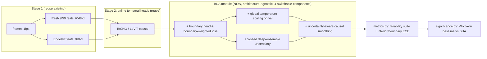

# Plan: Reliability-Oriented Online Surgical Phase Recognition on Cholec80

> **STATUS: APPROVED — this is the authoritative, governing plan for the project.**
> All work must conform to it. Execute on the local GB10 machine, in `tmux`,
> stopping to report after each phase. See `CLAUDE.md` for the condensed operating rules.

## Context

The goal is an SCI-publishable surgical phase recognition paper. Plain accuracy on
Cholec80 is **saturated** (offline relaxed-boundary SOTA ≈ 96% in 2026; this repo
already reaches 90.8% online / 91.5% offline video-avg). Score-chasing is not
publishable, and the field has an explicit self-criticism line ("Metrics Matter in
Surgical Phase Recognition", Funke et al.) that evaluation is inconsistent and
inflated by relaxed boundaries.

**Chosen research identity (user-approved):** *Beyond frame accuracy — a
reliability-oriented evaluation and a boundary-and-uncertainty-aware (BUA) module
for **online** surgical phase recognition.* The clinically deployable setting is
**online/causal**; frame accuracy is dominated by long phases and hides the two
things that matter clinically: (1) how promptly/cleanly phase **transitions** are
detected, and (2) whether the model's **confidence is trustworthy** (calibration).

**Three contributions (method + benchmark):**
1. **Headline metric & finding — boundary-region ECE.** Standard ECE averages over
   all frames and **dilutes** the over-confidence that concentrates at phase
   transitions. We introduce **boundary-region ECE** (calibration measured only in
   the ±tol neighbourhood of GT transitions) and show **interior-ECE ≪ boundary-ECE**
   for every online head — i.e. models look well-calibrated globally but are badly
   over-confident exactly where they err. This contrast is the most original result
   and is front-loaded in the framing.
2. **Benchmark:** a reproducible reliability evaluation suite for online phase
   recognition — accuracy + per-phase P/R/Jaccard (with & without relaxed boundary),
   segmental F1@{10,25,50}, segmental edit, over-segmentation, transition-detection
   latency & miss-rate, and calibration (ECE/MCE, reliability diagrams, interior-ECE
   vs boundary-ECE) — applied identically across temporal heads on identical features
   (controlled). Main conclusions are shown **insensitive to metric hyperparameters**
   via a dedicated sensitivity analysis (appendix).
3. **Method (BUA):** a lightweight, **architecture-agnostic** recipe with four
   switchable components — auxiliary boundary head + boundary-weighted loss,
   global temperature-scaling calibration, **5-seed deep-ensemble uncertainty**, and
   uncertainty-aware causal smoothing — that improves latency / over-segmentation /
   calibration **without** sacrificing accuracy, across multiple online heads. The
   calibration study compares three uncertainty sources head-to-head: **single model
   vs temperature scaling vs 5-seed deep ensemble** (ensembling typically dominates
   temperature scaling and is near-free since the seeds are run anyway).

**Why this fits the constraints:** builds entirely on the existing two-stage
pipeline (frame → CNN/ViT feature → temporal head); **no `mamba-ssm`** (so aarch64
GB10 is fine); Cholec80-only; GB10's 121 GB unified memory + unlimited time enables
5-seed runs for significance. Target venues: IJCARS, Computers in Biology and
Medicine, IEEE JBHI (clinically-framed, rigour-valued).

## Architecture of the change

The three BUA components are independently switchable so each can be ablated.
Components touch only generic logit/probability tensors, so the same module wraps
TeCNO and LoViT-causal unchanged.

## New / modified files

**`metrics.py` (NEW) — the reliability suite.** Pure numpy/torch-CPU so it is
unit-testable here without a GPU. Functions:
- `relaxed_correct(pred, gt, tol=10)` — standard Cholec80 relaxed boundary: within
  ±tol frames (10 s at 1 fps) of a GT transition, a prediction matching *either*
  adjacent GT phase counts as correct. Implement per Funke et al.; per-phase
  relaxed P/R/Jaccard variants built on the same masked counts.
- `get_segments(seq)` → list of `(label, start, end)`; `segmental_f1(pred, gt,
  overlap)` and `segmental_edit(pred, gt)` — MS-TCN/action-segmentation standard
  (Lea et al.): F1@{0.10,0.25,0.50}, normalized edit (Levenshtein over segment
  label strings).
- `over_segmentation(pred, gt)` → predicted-segment count and ratio to GT segments.
- `transition_latency(pred, gt, stable_k=3)` — per GT transition a→b at frame t,
  latency = first t'≥t with pred=b stable for ≥`stable_k` frames, minus t; missed
  if never reached within b's duration. Returns median/mean latency (s), miss-rate,
  and false-start count (early switches). Causal/online by construction.
- `calibration(probs, gt, bins=15, boundary_tol=10)` → ECE, MCE, reliability-curve
  arrays, **interior-ECE** (frames outside ±boundary_tol of any GT transition) and
  **boundary-region ECE** (frames within ±boundary_tol only). The interior-vs-boundary
  contrast is reported as a headline result, not just an aux number.
- **Sensitivity analysis** (appendix deliverable): the suite is parameterized by
  `tol ∈ {5,10,15}s` (relaxed boundary & boundary-ECE) and `stable_k ∈ {1,3,5}`
  (latency). `run_reliability.sh` sweeps these and `metrics.py` exposes them as args;
  we show the main conclusions hold across the grid → pre-empts the "Metrics Matter"
  (Funke) arbitrary-metric critique.
- `__main__` self-test on hand-built synthetic sequences with known boundaries to
  verify relaxed accuracy, F1, edit, and latency equal hand-computed values; assert
  `relaxed=False` accuracy matches `(pred==gt).mean()` so it is consistent with the
  current `evaluate.py`.

**`evaluate.py` (MODIFY).** Route metric computation through `metrics.py`; add
`--relaxed` and `--smooth`/`--temp T` flags; emit a per-video JSON + an `accs.npz`
(per-video accuracy and each metric) for significance. Keep the existing text table
(backward-compatible) so old reproduce commands still work. Reuse `build_from_ckpt`,
`load_features`, `TEST_IDS`.

**`calibrate.py` (NEW).** Calibration uncertainty sources, evaluated head-to-head:
- **Primary: single global temperature** (Guo et al. 2017). Collect val-set
  (`VAL_IDS` 33–40) logits via `load_features`, fit one scalar T by LBFGS on NLL,
  save to sidecar `*.temp.json`. Global because val is only **8 videos** — too small
  for stable per-phase fits.
- **Ablation only: per-phase temperature** vector, explicitly flagged as unstable on
  rare short phases (ClippingCutting, GallbladderPackaging) given the 8-video val set.
- **Deep ensemble:** `ensemble_uncertainty(ckpts, feat_dir)` averages the softmax of
  the 5 per-seed models (reuse `ensemble_eval.model_probs`); calibration is read off
  the averaged probabilities. Near-free since seeds are trained anyway.
The calibration results table compares **single model / temperature scaling / 5-seed
ensemble** on ECE, interior-ECE, boundary-ECE, and reliability diagrams.

**`smooth.py` (NEW).** `online_uncertainty_smooth(probs, gamma, conf_floor)` — a
causal filter over per-frame calibrated probabilities whose update gain scales with
predictive confidence: low-confidence frames cannot flip the running phase estimate,
suppressing flicker/over-segmentation and spurious early transitions while remaining
strictly online (no future frames). Used by `evaluate.py` and `ensemble_eval.py`.

**`mstcn.py` / `lovit.py` (MODIFY).** Add an optional auxiliary **boundary head**:
a `Conv1d(num_f_maps→1, k=1)` on the last stage's pre-logit features, returned
alongside class logits when `boundary=True`. Default off → existing behaviour and
checkpoints unchanged. Expose penultimate features from `SingleStageTCN`/`_Stage`.

**`train_tcn.py` (MODIFY).** Add `--boundary` (boundary-weighted CE: upweight CE on
frames within ±tol of a GT transition, plus boundary-head BCE with class-balancing)
and `--seed` (seed everything for multi-seed runs). Persist `boundary` and `seed` in
`cfg`. Reuse existing `mstcn_loss`; boundary terms are additive.

**`significance.py` (NEW at repo root).** Generalize `bootstrap/code/significance.py`:
load two result dirs (baseline vs +BUA), average each video over seeds, run paired
Wilcoxon over the 40 test videos for **each** metric (accuracy, Jaccard, segmental
F1, edit, latency, ECE), report mean Δ, win-count, p-value. Reuse `scipy.stats.wilcoxon`.

**`run_reliability.sh` (NEW).** Orchestrates the full matrix (below): for each head ×
{baseline, +calib, +BUA} × 5 seeds → train → calibrate on val → evaluate with the
suite → dump npz; then run `significance.py`. Mirrors the style of `run_sota.sh`,
using the `run.sh` `LD_LIBRARY_PATH` wrapper.

## Experimental matrix

Online/causal is the focus. All heads on **identical** features (ResNet50 first;
repeat on EndoViT for robustness). Offline MS-TCN / LoViT-offline kept only as
context rows.

| Axis | Values |
|---|---|
| Online head | TeCNO (causal MS-TCN) · LoViT-causal |
| Feature backbone | ResNet50 (ImageNet) · EndoViT (surgical MAE) |
| Variant | Baseline · +Calibration · +BUA(full) · BUA ablations (−boundary, −smooth, −calib, −ensemble) |
| Uncertainty source | single model · temperature scaling · 5-seed deep ensemble |
| Seeds | 5 (also serve as the deep ensemble) |

Each cell: full reliability suite, per-video npz, paired Wilcoxon (+BUA vs Baseline).
Both predicted outcomes are publishable: BUA improves latency/over-seg/ECE with
non-inferior accuracy (method works), **or** accuracy flat but the
accuracy-hides-failure finding + the suite stand on their own.

## Phased execution (stop and report after each phase)

**Phase 0 — Environment (GB10, aarch64 Blackwell).** GB10 is Grace-Blackwell +
aarch64, so a plain `pip install torch` very likely lacks the GPU's compute
capability. Install order, stop at the first that works: **(1)** NVIDIA NGC PyTorch
container (`nvcr.io/nvidia/pytorch`, arch+CUDA matched), **(2)** torch **nightly**
aarch64 wheel for CUDA 12.8 (`--index-url .../nightly/cu128`), **(3)** the matching
stable cu128 aarch64 wheel. Then timm, scikit-learn, scipy, opencv-python-headless,
huggingface_hub, tqdm, matplotlib, pandas. **Do not install mamba-ssm.** Bake in the
`bootstrap/README.md` gotchas: run python via `env -u LD_LIBRARY_PATH` (cuBLAS), use
`--amp_dtype bfloat16`. **Pass condition:** `torch.cuda` sees the GB10 **and** a
`bf16` matmul runs on-device without error. Record which install path worked and any
fallback used. *Report: env path used + GPU bf16 smoke test.*

**Phase 1 — Data (+ optional AutoLaparo request).** `rclone copy
cloudflare-r2:<bucket>/cholec80.zip ./data/` (~70 GB, `--s3-disable-checksum`),
unzip, then `extract_frames.py` at 1 fps. Verify 80 videos and frame counts. **In
parallel, submit the AutoLaparo access request now** (see conditional branch below).
*Report: data ready + counts + AutoLaparo request status.*

**Phase 2 — Baselines + new suite.** `train_cnn.py` → `extract_features.py`
(ResNet50); `extract_features_endovit.py` (EndoViT). Train TeCNO / LoViT-causal
(+ MS-TCN offline reference). Run **new** `metrics.py` to (a) reproduce existing
accuracy numbers and (b) produce the first full reliability table (relaxed,
segmental, latency, calibration) for these heads. *Report: baseline reliability
table — itself a deliverable.*

**Phase 3 — BUA + calibration.** Implement `metrics.py`, `calibrate.py`, `smooth.py`,
boundary head/loss; run the full matrix via `run_reliability.sh` (5 seeds); fit
temperature on val; evaluate; run `significance.py`. *Report: main results table +
ablations + significance.*

**Phase 4 — Analysis + draft.** Error/boundary analysis, reliability diagrams,
per-phase breakdown, BUA component ablation; write the paper (intro / related /
method / experiments / results / discussion) and figures. *Report: draft + figures.*

Dependency note: `metrics.py` (Phase 3 deliverable) is needed in Phase 2 — implement
and unit-test it **first** (it is CPU-only), then it serves both phases.

**Conditional branch — cross-dataset calibration drift (AutoLaparo).** AutoLaparo
needs an access application (submitted in Phase 1). The metric suite is
dataset-agnostic, so the branch is cheap to add:
- **If access granted before Phase 3 ends:** add a bonus *main* result —
  **Cholec80→AutoLaparo calibration drift**: measure how much ECE / boundary-ECE /
  latency degrade under procedure shift. NOTE (execution caveat): AutoLaparo is a
  *different procedure* (hysterectomy) with a *non-corresponding* 7-phase label
  space, so a naive "zero-shot" application of a Cholec80 classifier is not valid.
  The honest design is to fine-tune on a few AutoLaparo videos (or evaluate an
  AutoLaparo-trained model with the same suite) and report calibration transfer —
  finalize this design only if/when access actually lands.
- **If not granted:** stay single-dataset and list cross-dataset calibration
  transfer honestly as a limitation / future work.

## Verification

- **Unit (here, CPU, no GPU/data):** `python metrics.py` self-test passes
  (relaxed/segmental/edit/latency match hand-computed values; `relaxed=False`
  accuracy == `(pred==gt).mean()`). `python smooth.py` keeps a constant-phase
  sequence unchanged and removes a single-frame flicker. `python calibrate.py` on a
  synthetic over-confident logit set drives ECE down and finds T>1.
- **Pipeline parity (Phase 2, GB10):** new `evaluate.py --relaxed=False` reproduces
  the current numbers (TeCNO 88.95%, MS-TCN 90.81%) → confirms no regression.
- **Headline finding (Phase 2–3):** boundary-ECE > interior-ECE for every online head
  (the dilution claim), and the single/temperature/ensemble ordering on ECE is
  reported as an empirical finding — NOT treated as a pass/fail gate (either ordering
  is a valid result).
- **Robustness (Phase 3, appendix):** main conclusions unchanged across
  `tol ∈ {5,10,15}s` and `stable_k ∈ {1,3,5}`.
- **Method (Phase 3):** `significance.py` shows +BUA improves boundary-ECE / latency /
  over-segmentation with p<0.05 and non-inferior accuracy, across both heads — or, if
  not, the negative result is reported faithfully with the full suite.

## Out of scope / risks
- No `mamba-ssm`, no SurgicalMamba reproduction (aarch64 build risk); strong
  non-mamba online heads (TeCNO, LoViT-causal) are sufficient baselines.
- AutoLaparo handled as a **conditional branch** (above): bonus cross-dataset
  calibration-drift result if access lands in time, else an honest limitation. M2CAI
  remains future work.
- EndoViT was MAE-pretrained on surgical images possibly overlapping Cholec80 (no
  phase labels) → state the contamination caveat explicitly, as before.
